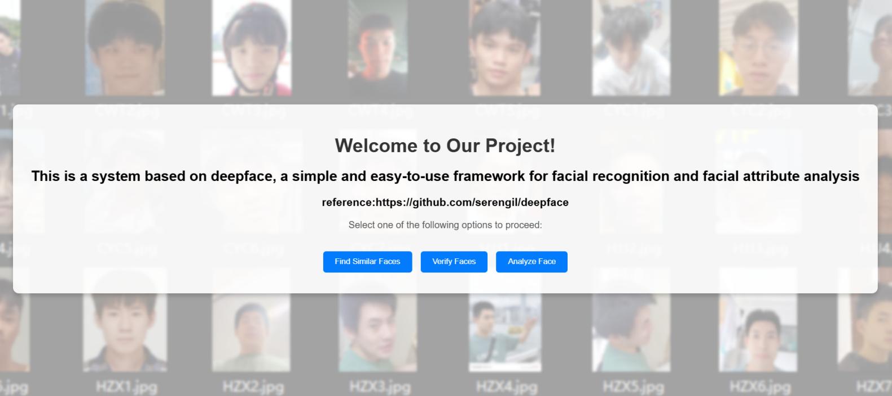

# cv_finalproject

This repository contains a facial recogntion system that uses the DeepFace library for facial recognition and analysis.

## Prerequisites

Before you can run this application, make sure you have the following installed:

- Anaconda or Miniconda

## Setting Up the Environment

Follow these steps to set up the environment:

1. Clone this repository

```
git clone https://github.com/c82531/cv_finalproject.git
```

2. Create a new Conda environment using the environment.yml file

```bash
conda env create -f environment.yml
```

3. Activate the Conda environment

```
conda activate deepface-env
```

## Running the Application

```
python app.py
```

## Quick start

Choose the mode:



Upload the file and generate results:

